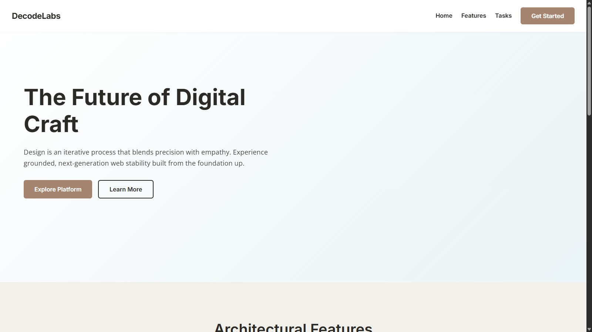
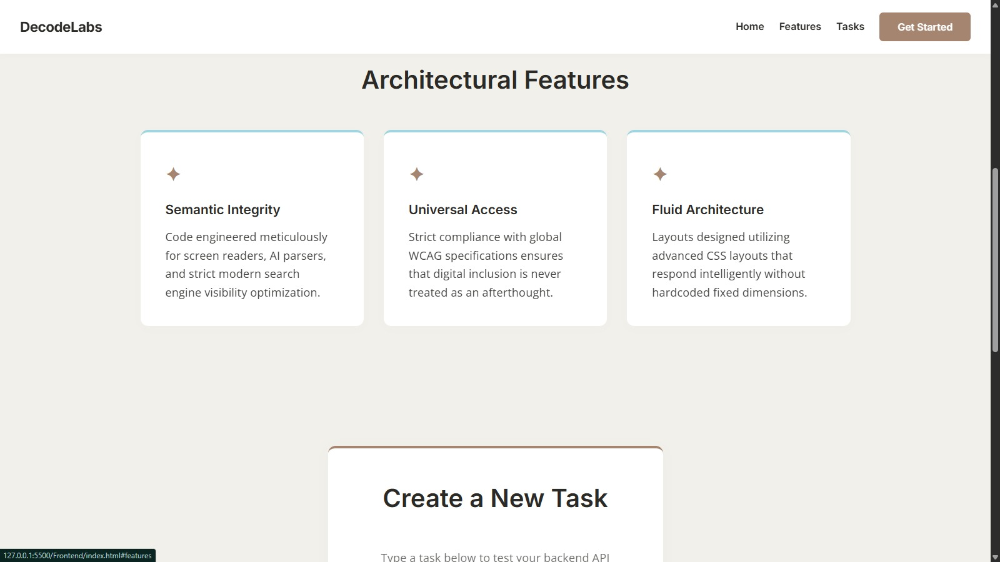
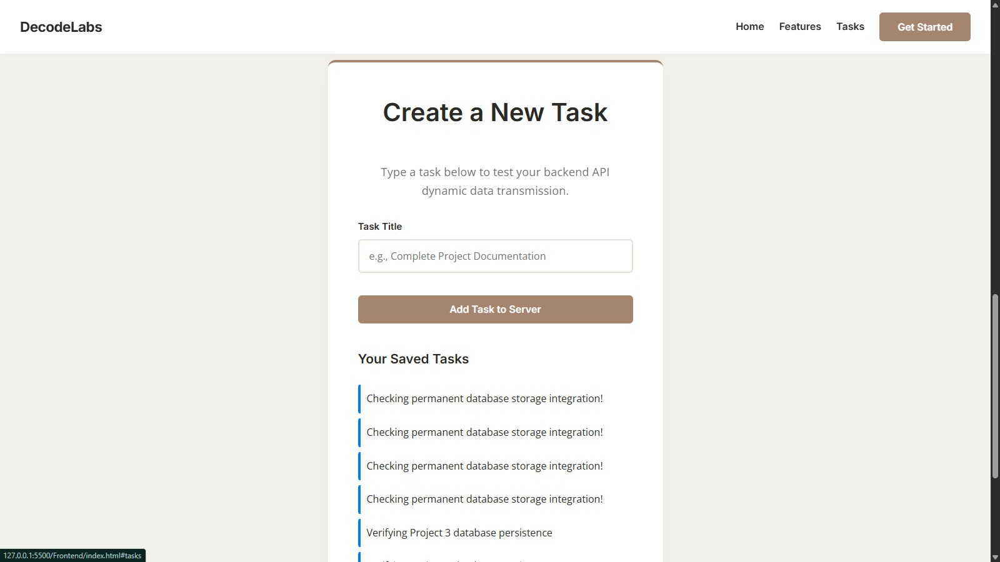
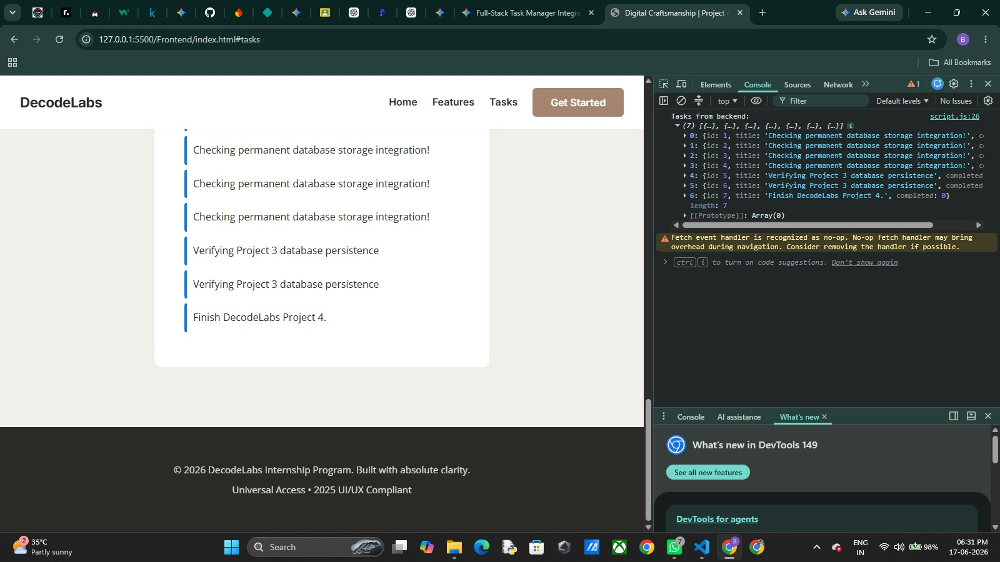

# Full-Stack Task Manager (Database Integration Phase)

A robust, full-stack Task Management application built as a part of the **DecodeLabs Industrial Training Track (Project 3)**. This milestone marks the structural evolution of the application from temporary in-memory arrays to permanent relational data persistence using an integrated data vault.

---
## 📷 Application Preview & Interface Walkthrough

<p align="center">
    
    
</p>
<p align="center">
    
    
</p>

---

## 🚀 Architectural Overview

This project bridges user interaction, business logic processing, and relational storage together into a cohesive full-stack pipeline:

1. **Frontend (UI Layer):** Built with semantic HTML5, modern CSS3 layout structures, and JavaScript (Fetch API). Captures asynchronous user inputs and renders live state views.
2. **Backend (Server Layer):** Powered by Node.js and Express. It enforces server-side runtime data validation, handles Cross-Origin Resource Sharing (CORS), and translates HTTP requests into database operations.
3. **Database (Persistence Vault):** Powered by an integrated SQLite3 storage engine. Moves the application from short-term RAM volatility to structured, persistent tables using unique SQL constraints.

---

## ✨ Features & Core Competencies Verified

- **Permanent Data Longevity:** Tasks remain fully intact and persist securely even across sudden backend server reboots or runtime engine restarts.
- **Relational Schema Design:** Designed an optimized table geometry including:
  - `id`: Automated incrementing integer acting as the absolute unique **Primary Key**.
  - `title`: Enforced non-empty text strings with string trim cleanups.
  - `completed`: Boolean binary states tracking completion metrics.
- **Server-Side Security Validation:** Defends database boundaries against empty or corrupted payloads returning precise HTTP response code diagnostics (`400 Bad Request`).
- **Asynchronous Data Bridges:** Full CRUD operation pipelines achieved natively using JavaScript Async/Await structures.

---

## 🛠️ Tech Stack Employed

- **Frontend UI:** HTML5, CSS3, Vanilla JavaScript (ES6+)
- **Server Runtime:** Node.js, Express.js
- **Database Architecture:** SQLite3 (Relational DBMS)
- **Version Control:** Git & GitHub Ecosystem

---

## 📂 Project Structure

```text
Full - Stack/
├── Frontend - Project 1/   # User Interface Assets
│   ├── index.html          # Web Content Layout
│   ├── style.css           # Styling Stylesheet
│   └── script.js           # Fetch API & DOM Logic
│
└── Backend/                # Server & Vault Infrastructure
    ├── server.js           # Core Express Server & SQL Queries
    ├── package.json        # Node.js Module Configurations
    ├── .gitignore          # Deployment Filter (Ignores node_modules)
    └── taskmanager.db      # Live Relational Database File (Local Storage)
⚙️ How to Setup and Run Locally
Prerequisites
Make sure you have Node.js installed on your local machine.

1. Initialize the Server Environment
Navigate to the Backend folder inside your command terminal and install the project dependencies:

Bash
cd Backend
npm install
2. Launch the Application Engine
Fire up the backend server:

Bash
node server.js
You should instantly receive the validation log: Database vault connected successfully! 📁

3. Open the Frontend Layout
Open the index.html file inside your browser (or use the VS Code Live Server extension on the frontend folder) to start managing tasks persistently!

🎯 Project:
This project fulfills the explicit mandatory qualification criteria required to master data architecture schemas and operational longevity state bridges under the DecodeLabs Full-Stack Developer Program framework.